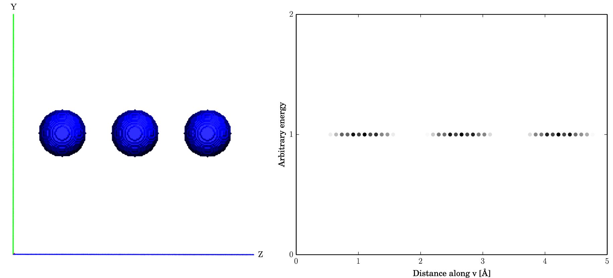
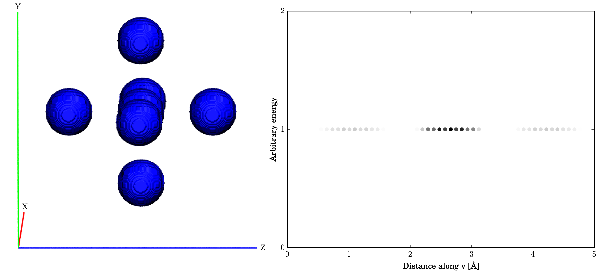
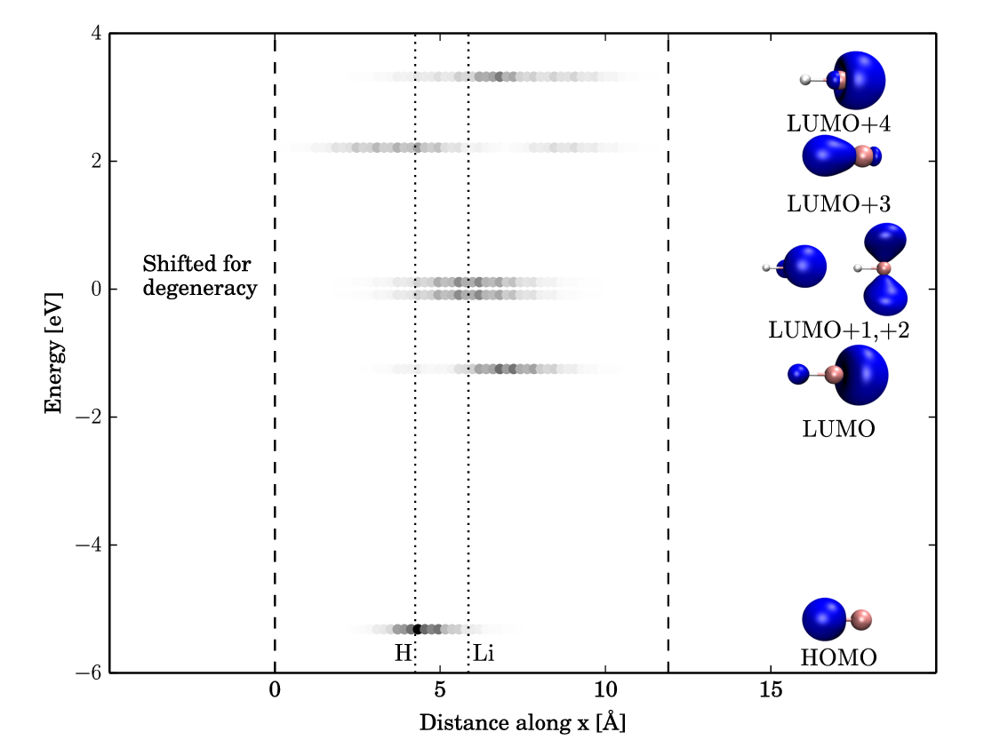

Level Diagrams
--------------

SOLD (Spatially Oriented Level Diagrams) produces diagrams that plot the
energies of single particle orbitals relative to one another.
Additionally, the lines show the spatial extent of the orbital with
darker colours indicating more weight in that region. The wavefunction
can be integrated along an arbitrary vector (given two points) which will yield different diagrams.

### Implementation

This code requires a Gaussian formatted checkpoint file (.fchk), G09
output file, number of occupied and virtual orbitals, and two points on
the line of integration as input. For the given number of orbitals,
their corresponding cube files are generated using the cubegen utility.
The points are used to find the line of integration using the method
described in the previous section. For each orbital, the square of every
point in the cube file is projected onto the line and binned
appropriately. The sums are then scaled to a value between 0-1 on a
global basis. That is, they are scaled relative to the maximum and
minimum sums over the set of all orbitals. After all orbitals have been
projected and scaled, they are plotted at their respective energies
using the scaled value as a colour map. If two orbitals are degenerate
(within 0.05 eV) then they are shifted. This is indicated on the graph.
The shift also prevents overlap of the two lines, which would distort
the data. Additional space is left on the graph on the left and right
sides to account for labels and bubble diagrams. The boundaries of the
box containing the volumetric data are denoted by dashed vertical lines.
The positions of selected atoms projected onto the vector are shown as
dotted vertical lines.

### Test Cases

To test the integration and scaling, cube files containing spheres were
generated. Fig. 3 shows three spheres placed
equidistantly along the z-axis. The integration was done along the
z-axis. As expected this level diagram contains three identical lines
that are spaced appropriately. Similarly, Fig. 4 shows
three groups of spheres on the z-axis. The middle group contains five
spheres, while the outer groups contain only one. Integrating along the
z-axis yields more weight on the middle group which is the desired
result.

<figure>

<figcaption>  Figure 1: Three equidistant spheres aligned on the z-axis as a test case. The corresponding level diagram is shown on the right. </figcaption>
</figure>
 
<figure>

<figcaption>  Figure 2: Spheres at three points along the z-axis as a test case. The middle point contains more spheres which yields more weight. The corresponding level diagram is shown on the right. </figcaption>
</figure>
 

Lithium hydride (LiH) was also investigated as a test case. Fig.
5 shows the level diagram where the integration
was done along the x-axis. The vertical dashed lines indicate the edges
of the box. Atomic positions are denoted by vertical dotted lines.
Comparing the levels with their corresponding bubble diagrams shows good
agreement. Of particular note, there is an area of minimal weight on Li
in LUMO+3 which can be seen on the scaled line.

<figure>

<figcaption>  Figure 3: Level diagram for LiH. Integration was done along the x-axis. </figcaption>
</figure>
