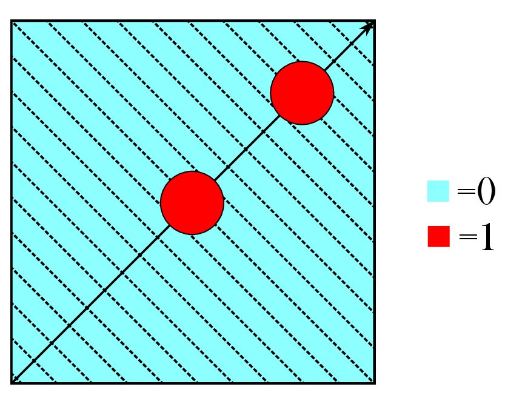
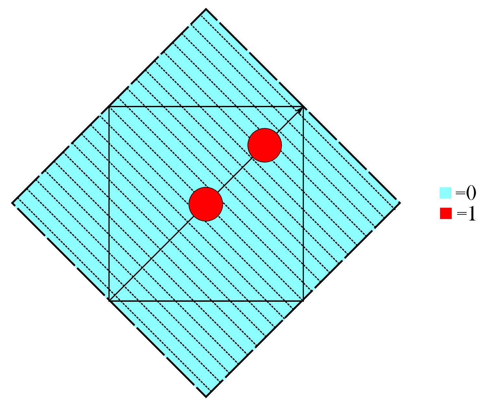

Level Diagrams
--------------

SOLD (Spatially Oriented Level Diagrams) produces diagrams that plot the
energies of single particle orbitals relative to one another.
Additionally, the lines show the spatial extent of the orbital with
darker colours indicating more weight in that region. The wavefunction
can be integrated along an arbitrary vector (given two points) which

will yield different diagrams.

### Theory {#theory-1}

To project wavefunction data onto an arbitrary vector, one needs the
equation of the line that passes through the given points $P_{1}$ and
$P_{2}$. The vector
$$\langle a,b,c \rangle = \langle x_{1}-x_{2}, y_{1}-y_{2}, z_{1}-z_{2}\rangle$$
connects $P_{1}$ and $P_{2}$. In three dimensions the equation of the
line
$$\langle x,y,z \rangle=(x_{1},y_{1},z_{1})+t\langle a,b,c \rangle$$ is
parameterized in terms of t. The points on the line that pass through
the faces of the box enclosing the volumetric data must be found. If the
points are not already on the face then the paremetric equations
$$\begin{aligned}
x(t)&=x_{1}+ta \\
y(t)&=y_{1}+tb \\
z(t)&=z_{1}+tc\end{aligned}$$ can be solved individually as long as
$a,b$ or $c$ are not zero. The case $a=b=c=0$ means that the two initial
points were the same which is not a valid input. The desired value of t
is the one that gives us the shortest distance from the point to the
boundary of the box. Using the relevant value of t gives the two points
on the boundary of the box that are also on the line of interest. This
vector $\mathbf{v^{\prime}}$ is then scaled to the length of the
diagonal of the box $$\begin{aligned}
\mathbf{v}=\frac{\mathbf{v^{\prime}}}{\Vert\mathbf{v^{\prime}}\Vert}\cdot d_{box}\end{aligned}$$
to avoid issues when projecting the volumetric data points.\
For each point $P_{i}$ in the data file, the distance from the origin is
projected onto $\mathbf{v}$ and the value at that point is stored in the
appropriate bin. The bin size is
$$\Delta v=\frac{\Vert\mathbf{v}\Vert}{N_{tot}}$$ where $N_{tot}$ is the
number of bins specified by the user. This projection is
$$\| \text{proj}_{\mathbf{v}}\mathbf{u} \|=\frac{|\mathbf{u}\cdot\mathbf{v}|}{\| \mathbf{v}\|}\|$$
where $\mathbf{u}$ is the vector connecting $P_{i}$ to the origin. The
value of the wavefunction at $P_{i}$ is added to a running sum in the
bin whose number is given by $$\begin{aligned}
N_{bin}=\text{round}\left(\frac{\| \text{proj}_{\mathbf{v}}\mathbf{u} \|}{\Delta v}\right).\end{aligned}$$
Additionally a counter keeps track of the number of elements contained
in the bin. This is to normalize the total sum of each bin by dividing
by the number of elements. However, this leads to over-representation of
bins with a low number of elements. The circle closer to the corner in
Fig. 1 will have a larger weight since the
number of elements in the bin is smaller. To rectify this problem, the
box is padded with zeroes as shown in Fig.
2. This extension of the box does not
affect the physics since the wavefunction is zero at the boundaries of
the box.

<figure>

<figcaption>   Figure 1: Illustration of binning within the box. </figcaption>
</figure>

<figure>

<figcaption>   Figure 2: Illustration of padding the box with zeroes to avoid over representation. </figcaption>
</figure>

### Implementation

This code requires a Gaussian formatted checkpoint file (.fchk), G09
output file, number of occupied and virtual orbitals, and two points on
the line of integration as input. For the given number of orbitals,
their corresponding cube files are generated using the cubegen utility.
The points are used to find the line of integration using the method
described in the previous section. For each orbital, the square of every
point in the cube file is projected onto the line and binned
appropriately. The sums are then scaled to a value between 0-1 on a
global basis. That is, they are scaled relative to the maximum and
minimum sums over the set of all orbitals. After all orbitals have been
projected and scaled, they are plotted at their respective energies
using the scaled value as a colour map. If two orbitals are degenerate
(within 0.05 eV) then they are shifted. This is indicated on the graph.
The shift also prevents overlap of the two lines, which would distort
the data. Additional space is left on the graph on the left and right
sides to account for labels and bubble diagrams. The boundaries of the
box containing the volumetric data are denoted by dashed vertical lines.
The positions of selected atoms projected onto the vector are shown as
dotted vertical lines.

### Test Cases

To test the integration and scaling, cube files containing spheres were
generated. Fig. 3 shows three spheres placed
equidistantly along the z-axis. The integration was done along the
z-axis. As expected this level diagram contains three identical lines
that are spaced appropriately. Similarly, Fig. 4 shows
three groups of spheres on the z-axis. The middle group contains five
spheres, while the outer groups contain only one. Integrating along the
z-axis yields more weight on the middle group which is the desired
result.

<figure>

<figcaption>  Figure 3: Three equidistant spheres aligned on the z-axis as a test case. The corresponding level diagram is shown on the right. </figcaption>
</figure>
 
<figure>

<figcaption>  Figure 4: Spheres at three points along the z-axis as a test case. The middle point contains more spheres which yields more weight. The corresponding level diagram is shown on the right. </figcaption>
</figure>

Lithium hydride (LiH) was also investigated as a test case. Fig.
5 shows the level diagram where the integration
was done along the x-axis. The vertical dashed lines indicate the edges
of the box. Atomic positions are denoted by vertical dotted lines.
Comparing the levels with their corresponding bubble diagrams shows good
agreement. Of particular note, there is an area of minimal weight on Li
in LUMO+3 which can be seen on the scaled line.

<figure>

<figcaption>  Figure 5: Level diagram for LiH. Integration was done along the x-axis. </figcaption>
</figure>
